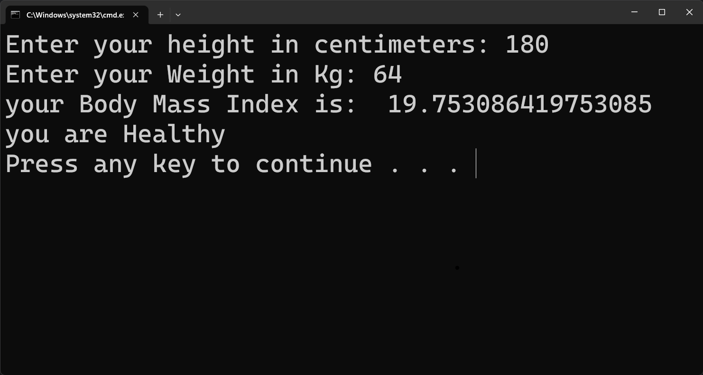
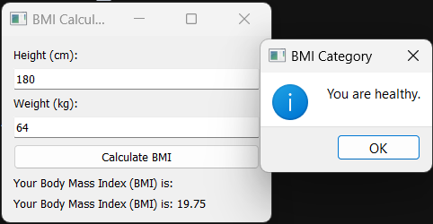

# BMI Calculator - Command Line Interface (bmicui.py)

## Description

`bmicui.py` is a Python program that calculates Body Mass Index (BMI) based on user-provided height (in centimeters) and weight (in kilograms). The program presents a simple command line interface (CUI) to interact with the user and provide BMI results along with remarks on their health status, such as healthy, underweight, or overweight.

## Features

- Easy-to-use command line interface for BMI calculation.
- Provides immediate feedback on the user's health status based on the calculated BMI.
- Supports metric units (centimeters and kilograms) for input.

## Usage

1. Make sure you have Python 3.x installed on your system.
2. Download or clone this repository to your local machine.
3. Open a terminal or command prompt and navigate to the project directory.
4. Run the `bmicui.py` script using Python:

```bash
python bmicui.py
```

5. Follow the on-screen prompts to enter your height (in centimeters) and weight (in kilograms).
6. The program will display your BMI and a remark about your health status.

## Screenshot



---

# BMI Calculator - Graphical User Interface (bmigui.py)

## Description

`bmigui.py` is a Python program that provides a graphical user interface (GUI) for calculating Body Mass Index (BMI) using PyQt5. The user can input their height (in centimeters) and weight (in kilograms) through the GUI, and the program will calculate the BMI and provide remarks on their health status, such as healthy, underweight, or overweight.

## Features

- Intuitive graphical user interface (GUI) for a seamless BMI calculation experience.
- Real-time BMI calculation and health status updates.
- Supports metric units (centimeters and kilograms) for input.

## Requirements

- Python 3.x
- PyQt5 library

## Usage

1. Make sure you have Python 3.x installed on your system.
2. Download or clone this repository to your local machine.
3. Open a terminal or command prompt and navigate to the project directory.
4. Run the `bmigui.py` script using Python:

```bash
python bmigui.py
```

5. A GUI window will appear, prompting you to enter your height (in centimeters) and weight (in kilograms).
6. Click the "Calculate BMI" button, and the program will display your BMI and a remark about your health status.

## Screenshot



---

We hope you find these BMI calculators useful for assessing your health status based on your height and weight. Whether you prefer a command line interface (CUI) or a graphical user interface (GUI) built with PyQt5, these programs have got you covered. Feel free to contribute to the project or provide feedback for improvements. Also feel free to reach out to me via `contact@adit.com.np` for anything. Namaste🙏